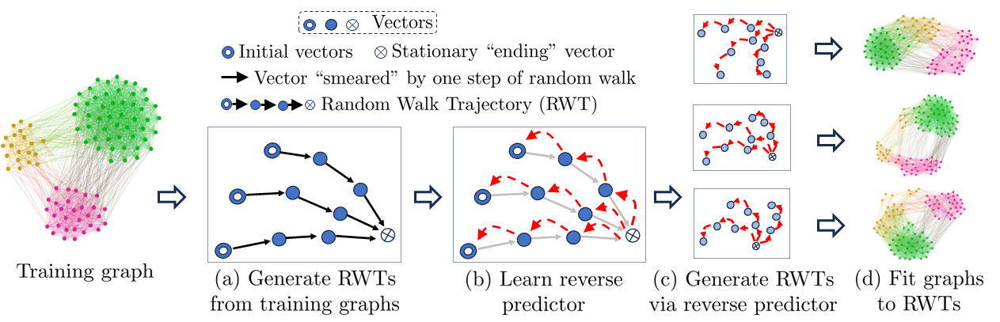

# GraphWeave: Graph Generation via Random Walk Trajectories

This repository contains code to run experiments with **GraphWeave**, a method for generating graphs using Random Walks

<p align="center">
  
</p>

## First compile orca. (see http://www.biolab.si/supp/orca/orca.html)
```cd orca```

```g++ -O2 -std=c++11 -o orca orca.cpp` ```

## Install requirements 
``` pip install requirements.txt```

## Register and Download Gurobi:

Go to the Gurobi Academic License page and register for a license.

Download and install Gurobi following instructions for your operating system.

## Install the Python Interface:
```pip install gurobipy```

## Activate Your License:
After installing Gurobi, run:
```grbgetkey <your-license-key>```

## Verify Installation:
```python -c "import gurobipy; print(gurobipy.gurobi.version())"```


## If there's no Gurobi, then we need to do the following:
In reconstruct.py, replace the two lines of the form ```prob.solve(solver=cp.GUROBI, ...)``` with an alternative such as ```cp.SCIPY``` or just ```prob.solve()```
Note that each solver has its own options, and Gurobi's options may not apply to SCIPY.

import tests

## Run SBM
```
import tests
tests.run_and_save_all(methods=['SBM'], lr=5e-3, epochs=1000, num_generated_graphs=40, save_res=True, use_existing_file=False)
```

 - Generates 40 graphs
 - Set ```save_res=True``` to save the results.
 - Then, in future runs, it will reload these results if ```use_existing_file=True```.


## The end result is as shown below. The column under "ratio GraphWeave" is reported in the paper.
| Metric        | inter GraphWeave | ratio GraphWeave | true       |
|---------------|------------------|------------------|------------|
| pagerank      | 0.000148         | 0.024441         | 0.000145   |
| closeness     | 0.004687         | 0.012441         | 0.004746   |
| betweenness   | 0.000300         | 0.635938         | 0.000183   |
| harmonic      | 0.529104         | 0.013219         | 0.536192   |
| connected     | 0.000000         | 0.000000         | 0.000000   |
| communities   | 8.010125         | 7.046603         | 0.995467   |
| cut_sizes     | 16.980828        | 0.018406         | 17.299239  |
| conductance   | 0.001280         | 0.032885         | 0.001240   |
| modularity    | 0.000593         | 0.097387         | 0.000540   |
| degree        | 0.223574         | 0.021854         | 0.218792   |
| clustering    | 0.050330         | 4.270950         | 0.009549   |
| orbit         | 413.933734       | 1.353608         | 175.871993 |
| spectral      | 0.029718         | 8.614763         | 0.003091   |
| maxflow       | 1.189633         | 0.009623         | 1.178295   |
| resistance    | 0.000792         | 0.022230         | 0.000810   |


## To simulate graphs of several types:
```tests.run_and_save_all(methods=['WS', 'BA', 'RGlikeSBM'], lr=5e-3, epochs=1000, num_generated_graphs=40, save_res=True, use_existing_file=False)```

## To generate Cora-like graphs
```tests.run_and_save_all(methods=['Cora'], lr=5e-4, epochs=1000, num_generated_graphs=40, save_res=True, use_existing_file=False)```

##  Reference:
If you use this paper in your research, please cite 
```
GraphWeave: Graph Generation by Random Walk Trajectories
by Rahul Nandakumar and Deepayan Chakrabarti, 
in ECML PKDD 2025
